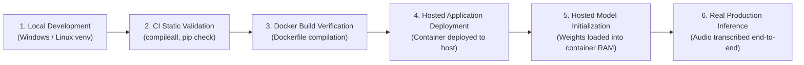
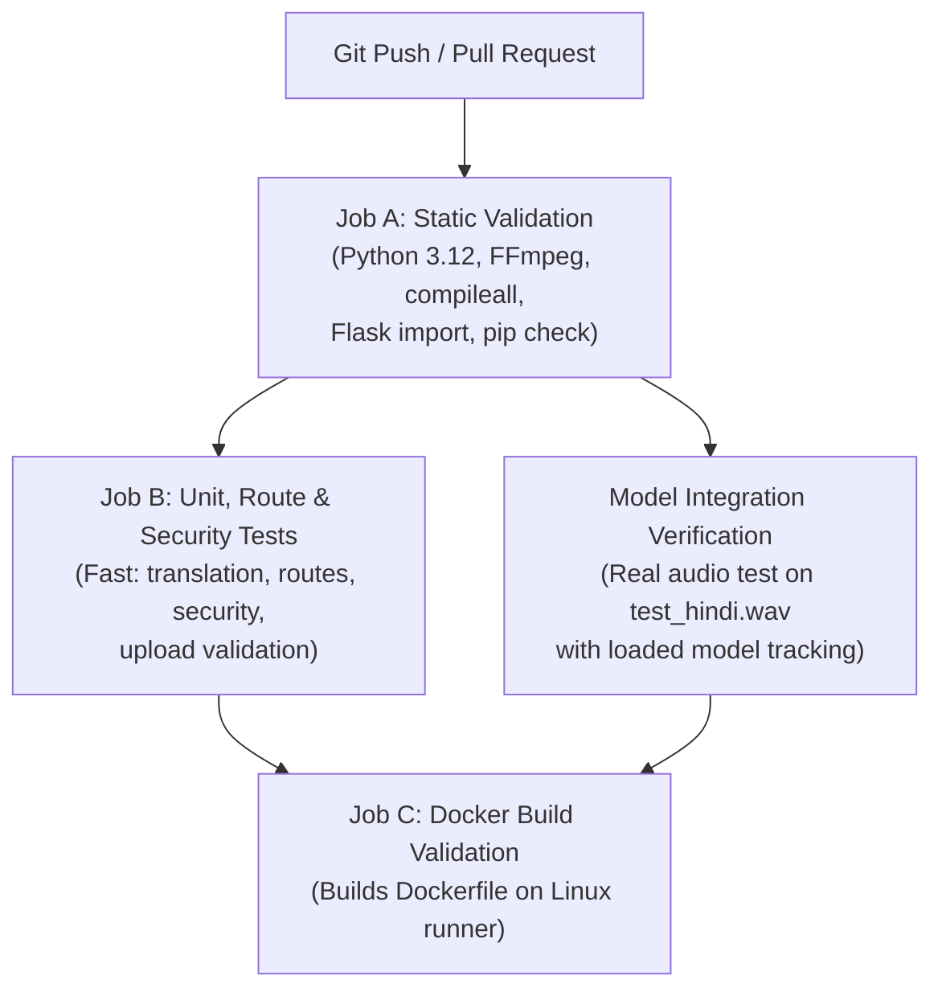

# Deployment Architecture, Hosting Feasibility, and CI/CD Manual

## 1. Hosting Feasibility & Platform Comparison

### Constraints Summary
- **Zero Card Requirement**: The developer does not possess a credit or debit card. Any platform requiring credit card verification to activate a "free tier" (such as Fly.io, AWS Free Tier, Google Cloud Platform, or Microsoft Azure) is disqualified.
- **Hosted Model Inference**: The speech recognition model must execute entirely on the hosted cloud infrastructure rather than relying on a local laptop or using paid third-party transcription APIs (e.g., OpenAI Whisper API, AssemblyAI).
- **Architecture Preservation**: Retain the existing custom dark glassmorphic web UI, Flask backend, and CTranslate2 Faster-Whisper pipeline without prematurely rewriting into Gradio or another framework.
- **Source of Truth**: The primary repository remains on GitHub with automated testing via GitHub Actions.

---

### Official Platform Policies & Hosting Feasibility Analysis

| Hosting Platform | Card Needed? | Free Compute / Memory | Container / Docker Support? | Can It Run Current Flask + CTranslate2 Stack? | Official Status & Verdict |
| :--- | :--- | :--- | :--- | :--- | :--- |
| **Hugging Face Spaces (Docker)** | **Paid Plan Required** | 2 vCPU / 16 GB RAM (on paid tier) | Yes (Custom Dockerfile) | Yes, but **not free** | **Requires Hugging Face PRO ($9/mo)** for personal accounts to create compute Docker Spaces. [Official Docs](https://huggingface.co/docs/hub/spaces-overview) |
| **Hugging Face Spaces (ZeroGPU)** | No | Dynamic GPU slice (daily quota) | Gradio / PyTorch SDK only | **NO** (Incompatible with Flask & CTranslate2) | Free personal accounts can host up to 2 Gradio ZeroGPU spaces, but ZeroGPU **requires PyTorch + Gradio**, not CTranslate2 or Flask. |
| **Render.com (Free Web Service)** | No | 512 MB RAM / 0.1 vCPU | Yes (Docker or Native) | **FAILS (OOM Exit 137)** | Memory limit (512 MB) kills Faster-Whisper instantly during model load. |
| **Fly.io** | **YES** | 256 MB RAM | Yes | Fails (Requires card even for free tier) | **Ineligible** (Requires credit card verification). |
| **Railway.app** | **YES** | Shared | Yes | Fails ($5 trial requires verification) | **Ineligible** (Requires card verification). |
| **Self-Hosted Cloudflare Tunnel** | **NO** | Local machine hardware | Yes / Native | **YES (Fully Functional)** | Free, no card required, exposes local Flask app securely to public internet. |

---

### Detailed Analysis of Hugging Face Spaces Policy

According to the official [Hugging Face Spaces Overview](https://huggingface.co/docs/hub/spaces-overview) and [Docker Spaces Documentation](https://huggingface.co/docs/hub/spaces-sdks-docker):

1. **Static Spaces are Free**: Spaces serving only client-side static HTML/JS/CSS are free for all users. However, our application requires a Python backend and CTranslate2 runtime.
2. **Compute-Enabled Docker Spaces Require a Paid Plan**: Creating a new compute-enabled Docker Space on Hugging Face now requires an eligible paid plan (such as Hugging Face PRO at $9/month) for personal accounts. Free personal accounts cannot launch new Docker compute containers.
3. **ZeroGPU Eligibility and Limitations**:
   - Free personal accounts in good standing may host up to two Spaces running on **ZeroGPU**.
   - However, [ZeroGPU](https://huggingface.co/docs/hub/en/spaces-zerogpu) is **specifically engineered for PyTorch-based workloads inside Gradio or Streamlit spaces** using `@spaces.GPU` function decorators.
   - **ZeroGPU is NOT a drop-in runtime for this application**: It does not support arbitrary CTranslate2 C++ binaries or custom Flask routing without an architectural rewrite.
   - Furthermore, free ZeroGPU has a strict **daily token quota** and is designed for interactive demos rather than persistent 24/7 web applications.

#### What Would an Architecture Migration to ZeroGPU Entail?
If the project were to migrate to qualify for free ZeroGPU hosting in the future, the following major code changes would be required:
- **Framework Replacement**: Replace `Flask`, `templates/index.html`, `static/style.css`, and `static/script.js` with `Gradio`. This would replace the custom dark glassmorphic UI, real-time Web Audio API waveform canvas, and dual translation display with standard Gradio UI blocks.
- **Inference Engine Replacement**: Replace `faster-whisper` and `ctranslate2` with standard `openai-whisper` or Hugging Face `transformers` running on PyTorch, wrapped with `@spaces.GPU`.
- **Trade-offs**:
  - *Advantage*: Qualifies for Hugging Face free ZeroGPU hosting.
  - *Disadvantages*: Loses the custom UI, introduces PyTorch dependency (~2.5 GB download), increases cold-start latency, and subjects users to daily GPU quotas.
- *Decision*: As instructed, **we do not perform this rewrite during this repair pass**, preserving the existing high-performance Faster-Whisper architecture.

---

### Production Deployment Distinctions

To ensure accurate engineering assessments, the following six operational stages must be clearly distinguished:



> [!IMPORTANT]
> A successful **Docker build verification** (Stage 3) simply proves that the Dockerfile and dependencies compile without errors. It does NOT prove that a cloud platform can run the model for free (Stage 4), that the container has enough RAM to initialize Whisper (Stage 5), or that real inference succeeds without timeout (Stage 6).

---

## 2. Docker Containerization Architecture

The repository provides a production [`Dockerfile`](file:///D:/SPEECH%20RECOGNITION/Dockerfile) and [`.dockerignore`](file:///D:/SPEECH%20RECOGNITION/.dockerignore).

### Key Container Specifications
- **Base Image**: `python:3.12-slim-bookworm` (lightweight Debian Linux base).
- **System Packages**: Installs `ffmpeg` via Debian `apt` so `pydub` and `audio_processing.py` can convert `.webm`, `.mp3`, and `.ogg` files without relying on Windows binaries.
- **Non-Root Execution**: Runs under non-root user `appuser` (UID 1000) with write permissions to `/app/static/uploads`, `/app/static/spectrograms`, and `/app/.hf_cache`.
- **Single-Worker Gunicorn Architecture**:
  - Gunicorn is configured with `--workers 1 --threads 4`.
  - **Memory Protection**: A single worker process ensures only **one** copy of the Whisper model is loaded in RAM (~2.2 GB). Spawning multiple workers would duplicate model weights into each worker process, consuming 4.4 GB to 8.8 GB of RAM and causing OOM termination.
- **Security Gate**: Configured with `ENABLE_SYSTEM_COMMANDS=false` to prevent remote OS execution in containerized environments.
- **Port Flexibility**: Binds to `0.0.0.0:${PORT:-7860}`.

### Building & Running Locally with Docker
```bash
# Build the Docker image
docker build -t speech-recognition-studio .

# Run the container locally (mapping port 7860 to http://localhost:7860)
docker run -p 7860:7860 speech-recognition-studio
```

---

## 3. GitHub Actions CI/CD Pipeline

The automated CI pipeline is defined in [`.github/workflows/ci.yml`](file:///D:/SPEECH%20RECOGNITION/.github/workflows/ci.yml).

### Pipeline Workflow Stages



#### Job A: Static Validation & Dependencies (`static-validation`)
- Runs on `ubuntu-latest` with Python 3.12.
- Installs system FFmpeg (`sudo apt-get install -y ffmpeg`).
- Installs pinned dependencies from `requirements.txt`.
- Compiles all Python files using `python -m compileall -q app.py utils` to detect syntax errors.
- Verifies Flask route mapping and core imports.
- Validates dependency consistency via `python -m pip check`.

#### Job B: Unit, Route, and Security Tests (`unit-and-route-tests`)
- Executes fast unit and route tests using Flask test-client:
  - Route tests: `GET /`, `GET /languages`.
  - Translation tests: Multi-tier fallback, language resolution, script normalization, error handling.
  - Security tests: Confirms OS command execution is blocked when `ENABLE_SYSTEM_COMMANDS=false`, confirms `POST /execute` returns 403 Forbidden, and validates confirmation token expiration.
  - Input validation: Missing files, empty filenames, unsupported extensions.
- Runs in seconds without downloading large model weights.

#### Model Integration Verification (`model-integration-verification`)
- Separately identified integration test executing real Faster-Whisper inference on `test_hindi.wav`.
- Sets `WHISPER_MODEL="base"` for standard GitHub Actions runner memory constraints.
- Explicitly queries `get_loaded_model_name()` to log and verify the actual model used during execution.

#### Job C: Docker Container Build Validation (`docker-build-verification`)
- Builds the `Dockerfile` using Docker Buildx to confirm container integrity and dependency compilation.
- Does not publish or push to unverified paid registries.

---

## 4. Production Operations, Recovery, and Rollback

### Diagnosing CI Pipeline Failures
1. In your GitHub repository, click the **Actions** tab.
2. Click the failed workflow run (marked with a red cross).
3. Expand the failing step (e.g., `Job A — Static Validation` or `Job B — Unit, Route & Security Tests`).
4. Read the exact failure log. Common causes:
   - Unquoted syntax in docstrings (`compileall` failure).
   - Conflicting package versions (`pip check` failure).
   - Broken test assertion in `test_translation.py`.

### Rolling Back a Faulty Release
If an unstable commit was pushed to your branch:
```bash
# Revert the latest commit safely without rewriting Git history
git revert HEAD

# Push the revert commit
git push origin feature/voice-assistant-linux
```

### Safeguarding the Local Environment
- **Never Run Destructive Git Commands**: Avoid `git reset --hard` or `git clean -fd` which can wipe uncommitted changes.
- **Protect Model Caches**: Ensure `.hf_cache/` remains in `.gitignore`. Never push 3 GB model files to GitHub.
- **Protect System Space**: Store model caches on drives with sufficient free space (such as `D:` drive) via `HF_HOME`.
